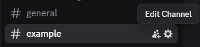
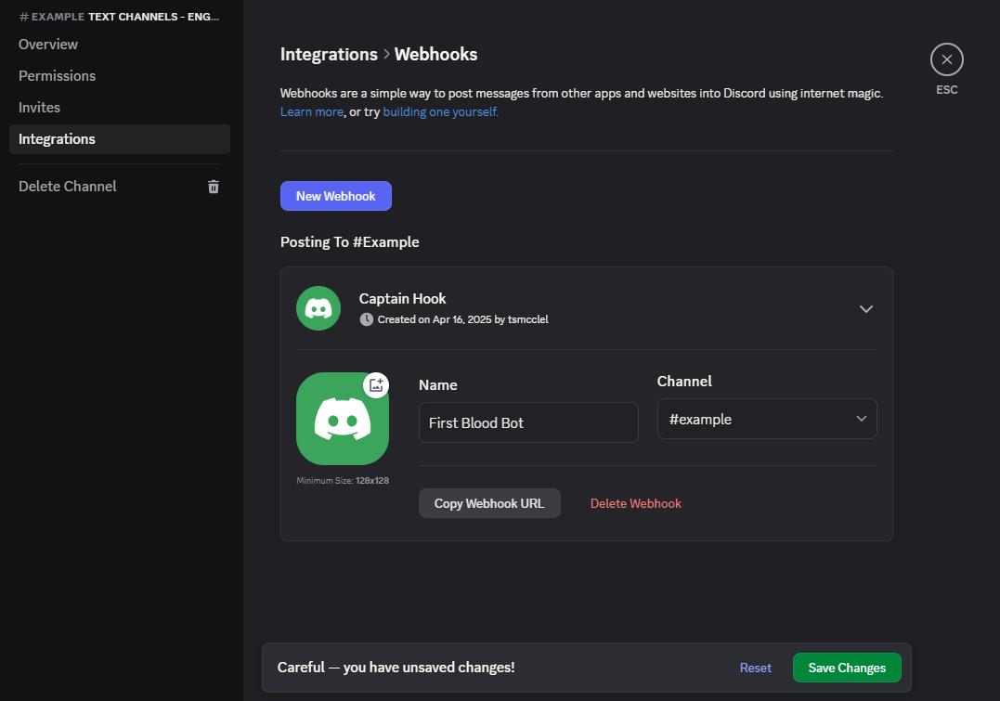
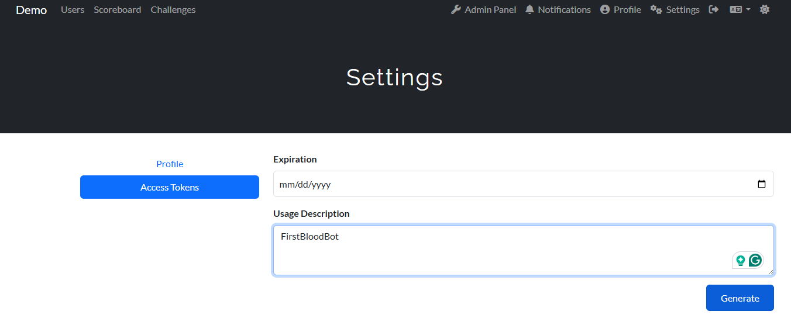

# Getting Discord Webhook URL
1. Open Discord and click on the "Edit Channel" button (Gear Icon)

2. Click on Integrations, then Webhooks
3. Click "New Webhook". You can change the name to anything you want.
4. Click "Save Changes" if you changed the Webhook name

5. Click the "Copy Webhook URL" button and paste it into the .env file (DISCORD_WEBHOOK_URL)

# Getting CTFd Token
1. Log in to CTFd as an admin user
2. Click "Settings" in the navbar
3. Go to "Access Tokens"

4. Generate an access token and paste it into the .env file (CTFD_TOKEN)

# Starting the First Blood Bot
`docker-compose up -d`

# Reset the Notified Challenges
1. Delete the contents of notified_challenges.json