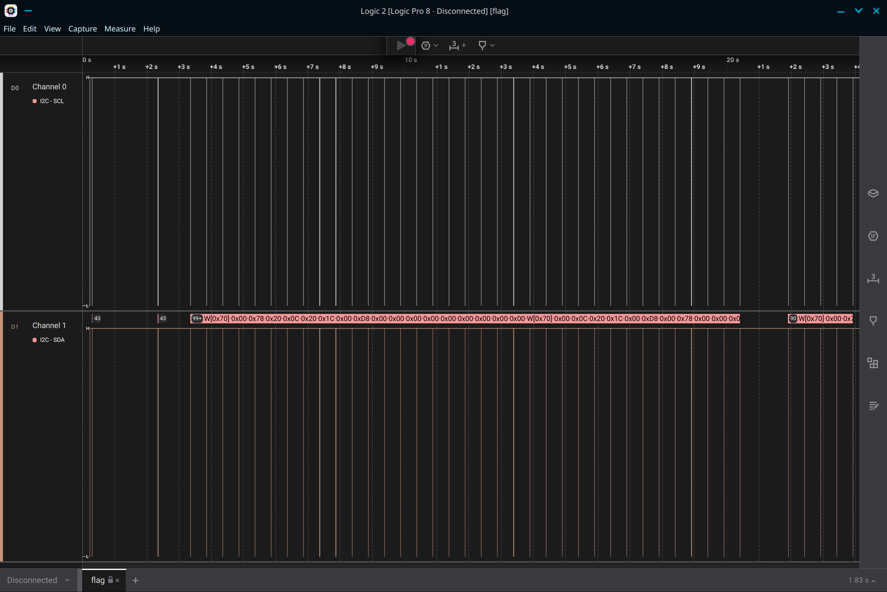
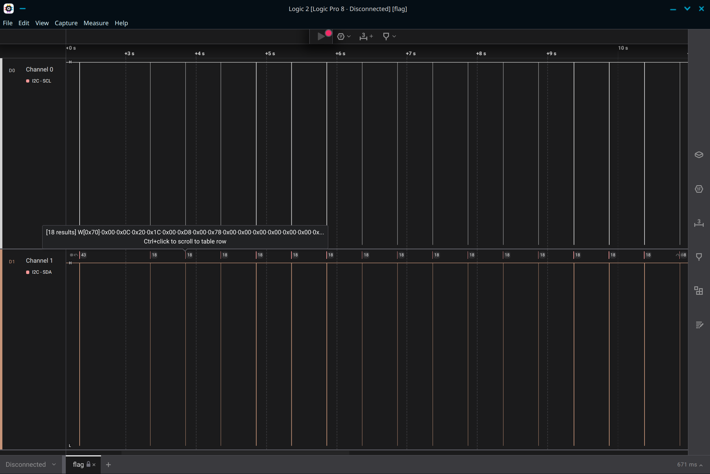
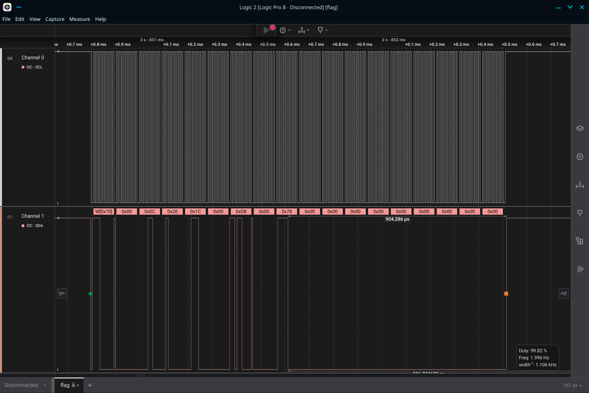

# Alpha
Description:
```markdown
I made a little Arduino program that displays a flag on a [14-segment display](https://www.adafruit.com/product/2157)! I captured the I2C data sent to the screen using my Saleae logic analyzer... can you decipher it and extract the flag?

[alpha_REDACTED.ino] [flag.sal]
```

**Author**: `Deltabluejay`

## Writeup
I2C is a hardware data transfer protocol. There are two important signals: SDA (Serial Data Line) transfers data while SCL (Serial Clock Line) serves as the clock to synchronize communication.

The `.sal` file is a data capture from the logic analyzer that can be opened using the [Logic 2](https://www.saleae.com/pages/downloads) software. Doing this will show you the SCL and SDA data:



Each of the vertical "lines" on the SDA channel is a stream of data being sent to the screen (if you zoom in, you'll see that it's actually the signal going up and down to represent 1s and 0s). If you hover on the number above it or zoom in, you can see the bytes of data:




If you look at the [datasheet](https://cdn-shop.adafruit.com/datasheets/2153datasheet.pdf) for the display (linked on the Adafruit product page), you'll see that there are 14 segments on each digit, and each segment has its own associated letter. If you look it up, you'll find that this kind of segment display is typically controlled by setting a bit corresponding to that segment to 1 to turn it on ([example](https://www.jameco.com/Jameco/workshop/TechTip/working-with-seven-segment-displays.html)).

Looking at the source code for the libraries referenced in the program further confirms this ([LED backpack](https://github.com/adafruit/Adafruit_LED_Backpack/blob/master/Adafruit_LEDBackpack.cpp#L337) and [I2C](https://github.com/adafruit/Adafruit_BusIO/blob/master/Adafruit_I2CDevice.cpp#L102)). In the I2C library, you'll also find the corresponding binary encodings of each character in the `alphafonttable` array. You can use this array to figure out which bit goes to which segment (hint: it's alphabetical).

```
A:  0000000000000001
B:  0000000000000010
C:  0000000000000100
D:  0000000000001000
E:  0000000000010000
F:  0000000000100000
G1: 0000000001000000
G2: 0000000010000000
H:  0000000100000000
J:  0000001000000000
K:  0000010000000000
L:  0000100000000000
M:  0001000000000000
N:  0010000000000000
DP: 0100000000000000
```

Looking back at the data, you can see that each I2C communication sends 18 bytes of data. The first two bytes are consistent with each communication and are related to the I2C protocol itself. The last sixteen bytes are the actual data we care about. You'll notice that only eight of those bytes ever have any data besides 0x00- that's because our display only has four digits (two bytes of data each), but the library supports larger displays.

Using the segment to bit conversion table, we can reverse the data from the sal file to determine what character was displayed on the screen. You can do this by hand, or write a script to do it for you (see [solve.py](./writeup/solve.py)).

**Flag** - `byuctf{4r3n7_h4rdw4r3_pr070c0l5_c00l?}`