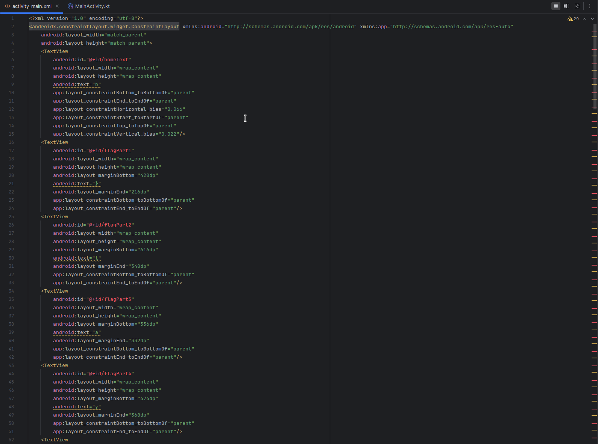

# Baby Android 1
Description:
```markdown
If you've never reverse engineered an Android application, now is the time!! Get to it, already!! Learn how they work!!

[baby-android-1.apk]
```

**Author**: `overllama`

## Writeup
TL;DR the functions in the Java decompilation just clear the main activity, which is obfuscated to hide the flag. You can either track the coordinates yourself, or do what I did and throw it in Android Studio or something else that can display the original XML for you.

Start by opening up jadx to poke around the APK. The only code function in our `MainActivity` is this:

```java
public class MainActivity extends AppCompatActivity {
    @Override // androidx.fragment.app.FragmentActivity, androidx.activity.ComponentActivity, androidx.core.app.ComponentActivity, android.app.Activity
    protected void onCreate(Bundle savedInstanceState) {
        super.onCreate(savedInstanceState);
        setContentView(R.layout.activity_main);
        Utilities util = new Utilities(this);
        util.cleanUp();
        TextView homeText = (TextView) findViewById(R.id.homeText);
        homeText.setText("Too slow!!");
    }
}
```

It sets up the context, and then runs `cleanUp()` from a Utilities class. This function just takes a lot of elements and performs this operation on them:
```java
TextView flag = (TextView) this.activity.findViewById(R.id.flagPart1);
flag.setText("");
```

So it's grabbing parts of the flag and setting them to `''`. This probably means that the flag is stored in those values initially and unset so we can't get it by running the app. Unless we set a breakpoint or something but idk how to do that. I have all kinds of ideas of how to solve, let's see what I end up on.

Starting to profile, we can use the `R` class to find all the flag parts. 

```java
    public static final class id {
        public static int flagPart1 = 0x7f0800c2;
        public static int flagPart10 = 0x7f0800c3;
        public static int flagPart11 = 0x7f0800c4;
        public static int flagPart12 = 0x7f0800c5;
        public static int flagPart13 = 0x7f0800c6;
        public static int flagPart14 = 0x7f0800c7;
        public static int flagPart15 = 0x7f0800c8;
        public static int flagPart16 = 0x7f0800c9;
        public static int flagPart17 = 0x7f0800ca;
        public static int flagPart18 = 0x7f0800cb;
        public static int flagPart19 = 0x7f0800cc;
        public static int flagPart2 = 0x7f0800cd;
        public static int flagPart20 = 0x7f0800ce;
        public static int flagPart21 = 0x7f0800cf;
        public static int flagPart22 = 0x7f0800d0;
        public static int flagPart23 = 0x7f0800d1;
        public static int flagPart24 = 0x7f0800d2;
        public static int flagPart25 = 0x7f0800d3;
        public static int flagPart26 = 0x7f0800d4;
        public static int flagPart27 = 0x7f0800d5;
        public static int flagPart28 = 0x7f0800d6;
        public static int flagPart3 = 0x7f0800d7;
        public static int flagPart4 = 0x7f0800d8;
        public static int flagPart5 = 0x7f0800d9;
        public static int flagPart6 = 0x7f0800da;
        public static int flagPart7 = 0x7f0800db;
        public static int flagPart8 = 0x7f0800dc;
        public static int flagPart9 = 0x7f0800dd;
        public static int homeText = 0x7f0800f1;
```

Those can then be tracked to the `activity_main.xml` file, which is what is loaded onto the screen when the program first runs, which makes sense. However, the mapping of the flag parts doesn't coincide with the ordering they would actually be in. For example, flagPart1 is actually the `}` at the end of the flag...
```xml
    <TextView
        android:id="@+id/flagPart1"
        android:layout_width="wrap_content"
        android:layout_height="wrap_content"
        android:layout_marginBottom="420dp"
        android:text="}"
        android:layout_marginEnd="216dp"
        app:layout_constraintBottom_toBottomOf="parent"
        app:layout_constraintEnd_toEndOf="parent"/>
```

BUT we can just take that xml file and render it, which solves that issue.

I ended up solving this challenges involved setting up [Android Studio](https://developer.android.com/studio). Open a new project, and we'll use this to render the page. Once the project loads, you can go into the `activity_main.xml` file, replace all the contents, and then render it.





Then you have the flag! Nice and simple :)

**Flag** - `byuctf{android_piece_0f_c4ke}`