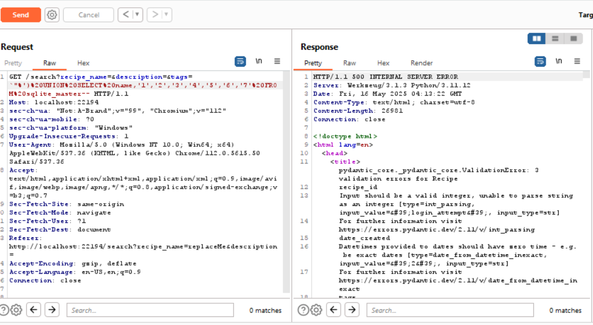
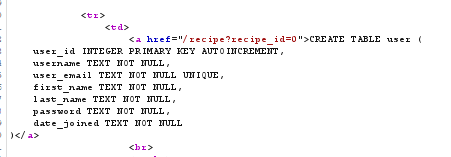

# Cooking Flask
## Challenge Description
"I threw together my own website! It's halfway done. Right now, you can search for recipes and stuff. I don't know a ton about coding and DBs, but I think I know enough so that no one can steal my admin password... I do know a lot about cooking though. All this food is going to make me burp. Sweet, well good luck"

## Initial Train of Thought
This challenge looks like some guy threw together their first website, but according to the the description, they are not very technical at all. Because he or she mentioned a lack of coding skills, this could have been vibe coded, bless their heart. Besides that, it is interesting that the challenge description says they don't know much about databases. It also mentions that the author hopes that their admin creds aren't stolen. There also seems to be a reference to use Burp Suite at the end. Let's take a look.

## First Look

This website looks like a pretty bare bones recipe website. None of the pages but this one seem to work right now. There is a search field. I wonder if there is the possibility of injecting something into there. We know the challenge description mentioned databased...Let's use a Burp Suite proxy page to send a test to check if any of the fields are injectible.

## Testing for Injection Vulnerability


Above we have our intercepted request that our Burp Suite proxy browser was going to send to the server. The vulnerability could still be anything, so we might as well try all the fields at once. If a field is vulnerable, sending a double-quotes,single-quote, and a backtick together are sure to cause a server error. We *might* see the result of this in a 500 range status code response. That would be really awesome.


Above is the new request. We only edited the field values to be
```
"'`
```

which could do nothing or something (which we may not see), but let's forward it!


Oh wow. Not only did this work (meaning it is sql injectible), but we saw the results. More than that, this is a Flask server running in debug mode! That's really bad. Please never do this. Use uvicorn or something. Because it's in debug mode, we can see that there is vulnerable sqlite we are breaking. Even better, we can see some of the actual server code on the line it's breaking. Debug mode is so useful!

## Finding WHERE it's Vulnerable
Ok, now we know at least one of the fields is vulnerable. From the error message above, it appears as though the author actually tried to do the right thing and parameterize their inputs (protects the server from treating request-data as sql code)


The image above shows me testing the first parameter


The request didn't crash the server. This indicates to me that that field is likely not the vulnerable one. `recipe_name` is not the vulnerable field.

I also tested the second field after this one and got nothing, so it's not `description`. That only leaves `tags` of all things


Above is the Burp Suite request injection for tags.


And it caused the same server error! Perfect! This indicates the server code must be changing the query with user-input before it is paramaterized. Bad

## How It's vulnerable


Interestingly, it seems like we are crashing right at this point by ruining the sqlite syntax. It looks like it's surrounding the tag we sent with something, and we are breaking the tail end of it. According to the debug error report, the syntax we are breaking is:
```
`"%')
```

What if we were to fix what we are breaking, and comment out the rest?


Wow that actually worked! As you can see in the Burp Suite image above, my request actually produced a 200 response! That means I caused the code to not crash! Here's what the code probably looks like on the server:
```sql
SELECT something something FROM something something WHERE ('%"` tag data goes here `"%') something something;
```

By injecting my specific request, I can change that to look like this:
```sql
SELECT something something FROM something something WHERE ('%"` `"%')-- `"%') something something;
```

All I injected was:
```
`"%')--
```

This allows me to execute arbitrary Select statements using a UNION SELECT style sql attack. For example:
```sql
SELECT something something FROM something something WHERE ('%"` `"%') UNION SELECT password FROM SECRET-- `"%') something something;
```

Which would allow me to steal any data that's in the table. The only problem is that I don't actually know how many columns are being selected. Time to do some enumeration!

## Enumeration
The way we enumerate sql depends on what service is actually running. Because it's sqlite, I had to look up a specific select statement that will give us the names of tables in the db. Found a good one. Essentially, we need to Union Select with this:
```sql
SELECT name FROM sqlite_master
```

We need to change this so it will actually work as a request. We just need to replace spaces with `%20` or `+`. Here is the new request:


As you can see, we didn't select enough columns. We need to add some dummy columns. An empty string will work fine. I will continue to add more and more empty strings as substitutes for columns until something changes.


As you can see above, finally, at eight columns (name and seven blank strings), I finally got a different error! Different errors are great in programming. Progress. As you can see, I finally had the right amount of columns in the right select as was in the server's left select. We now have a little better idea of what the sql statement looks like. It's probably similar to this:
```sql
SELECT 1,2,3,4,5,6,7,8 FROM something something WHERE ('%"` tag data goes here `"%') something something;
```

which we will inject to look like this:
```sql
SELECT something something FROM something something WHERE ('%"`
`"%')UNION SELECT name,'','','','','','','' from sqlite_master
--`"%') something something;
```

The new error indicates we got past our sql errors, but now we have a pydantic issue. Pydantic is a data validation package that can be installed from PyPi. It's really cool because it can take data and make sure it's in the right format before creating an object. This is a pain for attackers. Looks like SOME of that vibe coding paid off. Time to circumvent this. It is important to note that this would have been REALLY hard to figure out without debug mode. It tells us exactly what the issue is. It's a little tricky to know what column is the problem though. Let's change the empty strings to numbered strings.



Above are the renamed columns and a better error for whatever reason. I'll take it. Let's render that error so it's not an eyesore.


It looks like we have three validation errors. This means three attributes of a pydantic dataclass were the wrong type or formatted incorrectly (e.g. expected email format for a string value). We can see that our column '2' had a value that wasn't formatted right. It was expecting a date. Dates can be in SO MANY DIFFERENT FORMATS, so I don't know what it's looking for. Let's look this one up.


Ok chat says it wants international format. Easy!


Ok, great. We have one less error. Let's take a look at the `list` error. It says that the data we supplied was the integer 6- we didn't supply that. We supplied the string '6'. Maybe we need to put a sting in brackets like '[]'? It did say something about a json error earlier.


Perfect, that worked! Let's also change the rest of the values to ints while we're at it.


Ok clearly that was a mistake. In retrospect, I didn't read the error that well. It obviously stated that the value we were passing was `'login_attempt'`. That's not a value we hard-coded. Looking at our previous Select Statment, this is obviously coming from `name`:
```sql
SELECT name,'1','1970-01-01','3','4','5','[]','7' from sqlite_master
```

which would make sense, as login attempts are something sqlite probably has a table for!

Let's fix our mistake by changing our statment to this:
```sql
SELECT 0,name,'1970-01-01','3','4','5','[]','7' from sqlite_master
```

because it wants the index where name was to be an int. `0` works perfect. `'1'` can be replaced with `name` because both are strings!


YAY! That actually worked! Now we know all the table names!


Above is a close up of the tags field value that worked!


Whatmore, there is a table called `user`... I wonder what's stored there. Let's find out!


Above, I do a second enumeration technique where I run a different select statement that gets the create statement for the table `user`. Kind of a really weird command to be honest. Here it is without the url encoding:
```sql
SELECT 0,sql,'1960-01-01',3,'4','5','[]',7 FROM sqlite_master WHERE type='table' AND name='user'
```

This gave me the command that created the `user` table, which is pretty wild, as it has all the columns of the table, as well as their types and such.



By looking at the raw response or inspecting the page, I can see the different fields within this table. One of them is password Excellent! Now I have everything I need to complete my exploit.

## Completing the exploit
All I need to do now is change my Union Select injection to now Select `username` and `password` from the `user` table. I also did `user_email` for funsies, because why not.


AND IT'S THERE! THE PASSWORD IS DISPLAYED AS DATA WHERE RECIPE STUFF SHOULD BE.


By inspecting, we can see the full flag, as our screen was too small to display it all. Beautiful. We have it. Apparently they were not hashing passwords. YIKES! But I'll take it.

## Flag
`byuctf{pl34s3_p4r4m3t3r1z3_y0ur_1nputs_4nd_h4sh_p4ssw0rds}`