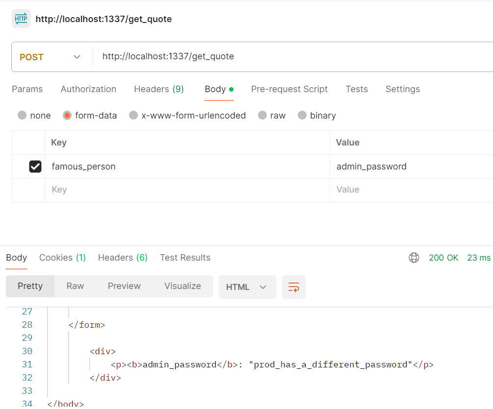

# Red This
Description:
```markdown
https://redthis.chal.cyberjousting.com

[redthis.zip]
```

**Author**: `CopperSands`

## Writeup
Redis is a NoSQL in memory database that in its most basic implementation uses simple key pairs. The basic implementation is redis-server. There is another implementation Redis Stack, which has addition querying tools and datatypes. Redis can be installed on all popular OS's and there is an official docker container that comes with default configurations. I was only able to find a little documentation on how to harden Redis server easily on the official documentation [here](https://redis.io/docs/latest/operate/oss_and_stack/install/install-redis/) under the `Securing Redis` section. The only hardening steps seem to be setting the bind address for the server (the acceptable IPs to originate a connection) to the loop back address `127.0.0.1`, firewall the ports, enable password authentication, and possibly use a third party SSL tunneling system for connections. They include this blurb "Note that a Redis instance exposed to the internet without any security is very simple to exploit, so make sure you understand the above and apply at least a firewall layer." The Docker container does not do any of this hardening for Redis Server or from what I can tell Redis Stack Server besides Docker requiring you to expose a port for a service. I did not expose a port for the Redis container. Instead I use a Docker internal network between the Redis container and the web server container to isolate connections.

### General Idea
There is a function that takes any key and returns its value `getData(key)`. There is a form with a selector whose value is sent to the `/get_quote` endpoint. `/get_quote` does not check for authorized values entered and uses `getData(key)` to return the value. There is a check that only allows the admin account to use `getData(key)` to get the value of the flag key. User passwords, and usernames are stored in the same database. The keys for user passwords have the naming convention `username_password`. 

You can send a POST request to `/get_quote` for the admin password. Then after logging in, You will see the key for the flag in the selector. Then you can simply use the form to get the flag.

### Solve
1. Use Postman or a similar tool to send a post request to `/get_quote` and set the form data to get the admin password, see Figure 1.


Figure 1 Admin password returned by `/get_quote`

1. Next visit the login endpoint `/login` and login
1. Now find the key for the flag in the selector
1. Use the selector to get the flag

**Flag** - `byuctf{al1w4ys_s2n1tize_1nput-5ed1s_eik4oc85nxz}`

## Hosting
This challenge should be a Docker container that runs a Flask server as a front-end on port 5005. All the proper files are included in here. The command to build the docker container is (when located inside of this directory):

```bash
docker compose up -d
```

To stop the challenge:
```bash
docker compose down
```